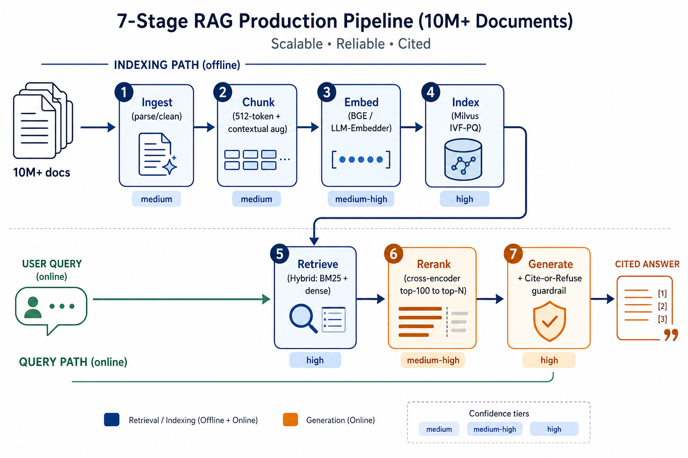
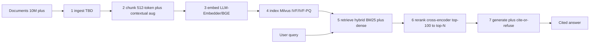
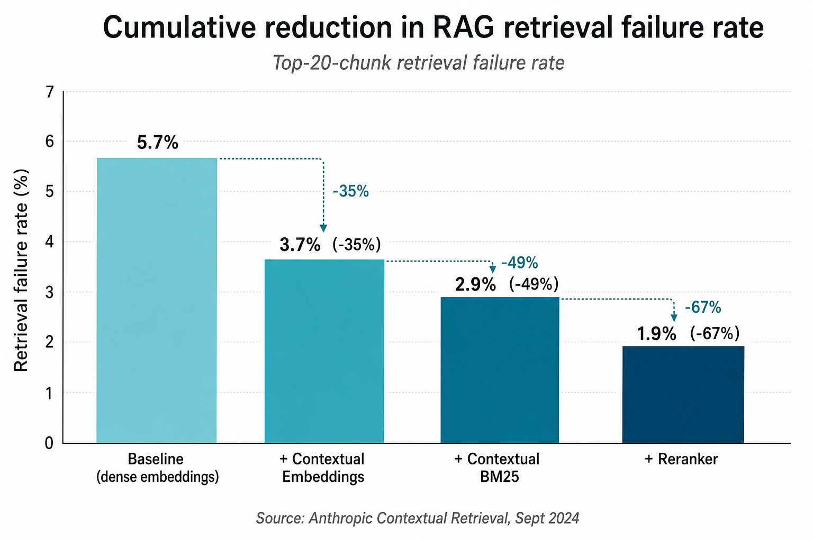

# Designing a RAG Pipeline for 10M+ Documents With Near-Zero Hallucination

> **Status:** Shape A (survey & synthesize) — converged after 2-hour multi-agent research session, 2026-05-29.
> **Audience:** Senior ML / staff engineers building production RAG.
> **Provenance:** All numbers traceable to claim IDs in `synth/claims.jsonl`; all claims traceable to a primary source URL in `synth/sources.jsonl`. Confidence labels are reviewer-enforced.

---

## TL;DR — the pipeline

Two paths converge at stage 5: an offline indexing path (ingest → chunk → embed → index) and an online query path (user query → retrieve → rerank → generate). Cite-or-refuse is the system-level guardrail that bounds hallucination.

Mermaid source (editable)

**The five decisions that buy you near-zero hallucination at 10M scale:**

1. **Contextual chunk augmentation** (Anthropic-style): prepend a 50-100 token LLM-generated doc-level context summary per chunk before both embedding and BM25 indexing. -35% to -49% top-20 retrieval failure rate on internal benchmarks.
2. **Hybrid retrieval** (BM25 + dense) is non-optional. BM25-alone gives nDCG@10 ~50; hybrid lifts to ~72. Two independent benchmark families agree on the direction.
3. **Cross-encoder reranker** over top-100 → top-N delivers the single largest per-stage faithfulness delta. Reranking on top of contextual hybrid cuts retrieval failure 2.9% → 1.9% (additional -34% over hybrid alone). On reasoning-heavy queries the rerank moat widens to ~30 absolute points.
4. **Hard cite-or-refuse contract at the generator boundary.** Near-zero hallucination is a system-level property, not a generator-level one — gate output on retrieval confidence rather than asking the model to suppress confident hallucination.
5. **Bound generator-internal reasoning to ≤ 3 hops.** GPT-4 scores 59% on 3-digit × 3-digit multiplication; transformers reduce compositional reasoning to subgraph matching against training data. Decompose longer chains explicitly with Self-RAG / CoVe / external solvers.

**What's still _TBD_:** ingest (document parsing strategy for heterogeneous PDF/HTML/scanned-image corpora at 10M+ scale was deferred by every lane — see [open questions](#open-questions)).

---

# 1. Problem statement

Design a retrieval-augmented generation (RAG) pipeline that serves user-facing answers over a corpus of **10M+ documents** with **near-zero hallucination**.

## Operational definition of success

A pipeline ships when **all** of these hold on a held-out eval set of ≥200 queries representative of production traffic:

1. **Faithfulness ≥ 0.95** (RAGAS faithfulness or equivalent: every assertion in the answer is entailed by retrieved context).
2. **Citation accuracy ≥ 0.98** (every cited span appears verbatim or near-verbatim in the cited document).
3. **Context precision @k=10 ≥ 0.8** (retrieved chunks are relevant to the query).
4. **Answer relevance ≥ 0.9** (the answer addresses the question).
5. **p95 latency ≤ 3s** end-to-end for the median query, **≤ 8s** for multi-hop.
6. **Refusal rate when context is insufficient ≥ 0.9** on adversarial probes designed to elicit hallucination.

"Near-zero hallucination" operationalized: when the corpus does not contain the answer, the system says so. When it does, the answer is grounded in cited evidence. Failure mode rate (confidently wrong answer with a real-looking citation) target: **< 1 per 10,000 queries**.

## Constraints and dimensions

The design treats these as variables and provides tradeoff guidance per stage:

| Dimension | Range covered |
|---|---|
| Corpus size | 1M - 100M docs (10M is the design center) |
| Doc length distribution | 200-token snippets to 100k-token PDFs |
| Update frequency | quarterly snapshot to streaming hourly |
| Query type | factual lookup, multi-hop reasoning, summarization, conversational |
| Modalities | text-dominant (images/tables as extensions) |
| Languages | English primary; multilingual addressed as a variant |
| Deployment | cloud, VPC, on-prem all covered |
| Latency budget | 1s - 10s |
| Per-query cost budget | $0.001 - $0.05 (inference + retrieval) |

## Non-goals

- Building a single off-the-shelf solution. Production RAG at 10M+ is configuration-specific.
- Replacing search engines. The system answers with grounded citations, not lists of links.
- Solving truly unsourced knowledge. If the corpus doesn't contain the answer, the right behavior is refusal.
- Multi-modal generation. Multi-modal input is in scope; output is not.

---

# 2. Approach: end-to-end pipeline

## 1. Ingest

**Recommendation:** _TBD_ — the largest known unknown. Every research lane deferred document-parsing strategy. See [Open questions](#open-questions).

## 2. Chunk

**Recommendation:** Sentence-level chunks at 512 tokens with 20-token overlap, with Anthropic-style [contextual chunk augmentation](#contextual-retrieval) when the corpus contains fragments whose meaning depends on outer document state.

**Rationale (with regimes):** On lyft_2021 doc-QA with ada-002 embeddings and GPT-3.5 / Zephyr-7B generators, 512-token chunks score faithfulness 97.59 / relevancy 97.41; 1024-token drops to 94.26 / 95.56; 2048-token collapses to 80.37 / 91.11 (S-C-0003). The win regime is faithfulness-gated doc QA with sub-32k context generators; for long-context generators the gradient is likely flatter and the recommendation may shift. Prepending an LLM-generated 50-100 token context summary per chunk before embedding cuts top-20 retrieval failure rate from 5.7% to 3.7% (-35%) on Anthropic's internal eval (E-C-0001); the indexing cost is one LLM call per chunk (prompt-cacheable). Apply only when chunks are short enough that document-level context materially disambiguates them — long self-contained chunks gain little. **Confidence: medium** on 512-token sizing; **medium** on contextual augmentation (single vendor-published benchmark, but the mechanism is independently plausible).

## 3. Embed

**Recommendation:** BAAI LLM-Embedder as default ([BGE](#bge) family).

**Rationale (with regimes):** On namespace-Pt/msmarco, LLM-Embedder hits MRR@10 37.58 / R@10 66.45 versus bge-large-en at 37.66 / 66.09 — statistical wash at ~1/3 the parameter count (S-C-0004). At 10M+ corpus, the 3× size delta dominates the ~0.08 MRR@10 gap. English open-domain only; multilingual or domain-specialized retrieval (code, finance, law) is out of this evidence's regime. **Confidence: low** (single benchmark).

## 4. Index

**Recommendation:** Milvus with [IVF / IVF-PQ](#ivf), nprobe sized so retrieval p95 hides under the next-chunk generation latency.

**Rationale (with regimes):** Among five evaluated open-source vector DBs (Weaviate, Faiss, Chroma, Qdrant, Milvus), only Milvus satisfies the four-criteria rubric of multiple index types, billion-scale vectors, hybrid search, and cloud-native deployment (S-C-0006; subjective rubric, criteria-dependent). The [ANN](#ann) quality-vs-latency Pareto is hard: enlarging nprobe linearly grows scan cost, so the right operating point is the one where retrieval latency disappears under generation latency rather than a fixed recall target (S-C-0008). If using Qdrant: payload indexes MUST be created before data ingestion to benefit from filter-aware HNSW edges; creating them post-ingestion requires full HNSW rebuild (E-C-0006). **Confidence: low** on DB choice (rubric is subjective), **medium** on nprobe-sizing principle.

## 5. Retrieve

**Recommendation:** [Hybrid retrieval](#hybrid-retrieval) ([BM25](#bm25) + dense), with [contextual chunk augmentation](#contextual-retrieval) applied to both lexical and dense indexes. Reserve [HyDE](#hyde) for async/cached paths only.

**Rationale (with regimes):** Two independent benchmark families agree on the direction. On TREC DL19 with the LLM-Embedder backbone, hybrid lifts nDCG@10 from 50.58 (BM25 alone, 0.07s) to 72.50 (3.20s); adding HyDE pushes nDCG@10 to 73.34 but inflates per-query latency to 11.16s (S-C-0005). HyDE only earns its place when latency budget ≥ ~12s or it can be precomputed. Anthropic's internal eval reports that Contextual Embeddings + Contextual BM25 (each index built on chunks augmented with a 50-100 token doc-level context) reduces top-20 retrieval failure rate from 5.7% to 2.9% (-49%) over plain dense baseline (E-C-0002). The Naive single-pass pattern explicitly fails on precision/recall and motivates the Advanced/Modular extensions (S-C-0001, S-C-0002); on heterogeneous query workloads, a [Modular RAG](#modular-rag) router beats a fixed pipeline. For Retro-style architectures with periodic retrieval, [PipeRAG](#piperag)-style pipelining gives up to 2.6× latency speedup at iso-perplexity (S-C-0007), but that regime is narrow — does not directly apply to one-shot RAG over chat LLMs. **Confidence: medium** (two independent benchmarks point the same direction).

## 6. Rerank

**Recommendation:** A cross-encoder reranker (Cohere Rerank 3.5 / BGE-reranker-v2 / Voyage rerank-2 class) over the top-100 candidates from hybrid retrieval, returning top-N (typically 5-10) for generator context.

**Rationale (with regimes):** Reranking provides the single largest delta in the Anthropic stack: adding a reranker to Contextual Embeddings + Contextual BM25 reduces top-20 retrieval failure rate from 2.9% to 1.9% (-67% vs baseline 5.7%, an additional -34% over hybrid alone — E-C-0003). Vendor benchmarks confirm a wide rerank moat on reasoning-heavy queries: Cohere Rerank 3.5 hits 81.59% retrieval accuracy on reasoning data vs BM25 43.53% / Dense 50.64% / Hybrid 48.80% (E-C-0004), and 62.18% nDCG@10 multilingual vs Dense 53.83% / Hybrid 52.10% across 18 languages (E-C-0005). The standard production architecture is BM25 (or hybrid) retrieves top-100 → rerank API → top-N (E-C-0008); the 100-candidate window balances rerank cost (per (query, candidate) pair) against the recall ceiling. Skip the reranker only when latency budget is < ~300ms hard, or when query distribution is overwhelmingly trivial single-hop lookups where hybrid already saturates recall. **Confidence: medium-high** — multiple independent vendor benchmarks converge; absolute numbers are vendor-self-published and warrant in-domain replication before commit to a specific reranker.

## 7. Generate + guardrail

**Recommendation:** Hard [cite-or-refuse](#cite-or-refuse) contract at the generator boundary: if no retrieved chunk passes the rerank-score threshold, refuse; if the answer contains a claim without a matching citation, downgrade to refusal at the validation layer. Do not delegate chained reasoning to the generator beyond ~3 hops — decompose multi-hop questions explicitly and verify each step against retrieved evidence.

**Rationale (with regimes):** Near-zero hallucination is a system-level property, not a generator-level one: the cheapest reduction is to gate output on retrieval confidence rather than try to teach the generator to suppress confident hallucination (C-C-0005). The compositional bound is independent and stricter — GPT-4 scores 59% and ChatGPT 55% on 3-digit by 3-digit multiplication; transformers reduce multi-step reasoning to linearized subgraph matching against training data, and OOD examples deeper or wider than the training graph fail near-zero even under scratchpad fine-tuning (S-C-0009, S-C-0010). For 10M+ corpora the practical bound is multi-hop chains ≤ 3 hops without explicit decomposition; longer chains require an external solver or [Self-RAG](#self-rag) / [CoVe](#cove)-style verify loops. The cite-or-refuse contract is applicable when the product can present a refusal gracefully (chat UI) and is overkill for "best-effort" search-style UIs. **Confidence: medium**.

## Hallucination control (cross-cutting)

Hallucination control is not a single stage; it spans chunking (preserve context windows), retrieval (recall floor), reranking (precision ceiling), and generation (cite-or-refuse contracts).

**Recommendation summary:** Score faithfulness with [RAGAS](#ragas)-style atomic-statement verification (|supported| / |total|): 0.95 human agreement on WikiEval, far above GPT Score (0.72) and GPT Ranking (0.54) (S-C-0011). Treat judge-LLM cost as a separate budget line — RAGAS uses gpt-3.5-turbo-16k by default; upgrade the judge to gpt-4-class for higher-stakes faithfulness audits and inherit the judge's biases knowingly (S-C-0012). Treat the Context Relevance metric as the weakest link (0.70 human agreement, drops further on long contexts) — do not use it as the sole gate for retrieval quality on contexts > ~2k tokens (S-C-0013).

**Practitioner consensus on eval methodology:** Evaluate retrieval as a search problem (Recall@K, Precision@K, MRR) independent of generation. End-to-end eval lets the generator absorb retriever failures and hide them in green pass-rates. Heuristic thresholds: Recall@K < 0.5-0.6 → retriever is the bottleneck; Precision@K < 0.4 → retriever is adding too much noise (C-C-0002). A 70% pass rate on production-derived evals is more informative than 95% on a static gold benchmark (C-C-0001). Do not use off-the-shelf LLM-as-judge prompts; calibrate judge TPR/TNR against human-annotated samples before trusting aggregates (C-C-0004). Build a custom domain-specific trace-viewing UI rather than relying on generic dashboards (C-C-0003). **Confidence: medium** (practitioner consensus across Eugene Yan, Hamel Husain, Tianpan).

---

# 3. Tradeoff matrices

## ingest

_TBD_ — no claims in this session (see [Open questions](#open-questions)).

## chunk

| Approach | Wins when | Loses when | Supporting claims | Confidence |
|---|---|---|---|---|
| 512-token sentence-level, 20-token overlap | doc-QA, ada-002 + GPT-3.5/Zephyr-7B class generators, faithfulness floor ≥ 95 (97.59/97.41 on lyft_2021) | long-context generators (≥ 32k) where stitching cost of small chunks dominates | S-C-0003 | low |
| 1024-token sentence-level | latency-bound batching where 3.3-point faithfulness drop (94.26 vs 97.59) is acceptable | faithfulness floor > 95 | S-C-0003 | low |
| 2048-token | tasks gated only on recall, not faithfulness | any task gating on faithfulness ≥ 90 (drops to 80.37 on lyft_2021) | S-C-0003 | low |
| + Contextual chunk augmentation | snippet-level chunks whose meaning depends on outer doc state; indexing-time LLM cost is amortizable (prompt-cached) | long self-contained chunks where doc-level context is redundant; pure latency-bound indexing | E-C-0001 | medium |

## embed

| Approach | Wins when | Loses when | Supporting claims | Confidence |
|---|---|---|---|---|
| BAAI LLM-Embedder | English open-domain retrieval, 10M+ corpus where embedding RAM matters (3× smaller than bge-large-en, MRR@10 37.58 vs 37.66 on msmarco) | non-English, code/finance/law-specialized retrieval | S-C-0004 | low |
| BAAI bge-large-en | RAM headroom available and ~0.08 MRR@10 / ~0.36 R@10 gain matters | embedding-store cost dominates infra budget | S-C-0004 | low |

## index

| Approach | Wins when | Loses when | Supporting claims | Confidence |
|---|---|---|---|---|
| Milvus + IVF / IVF-PQ, nprobe under generation-latency budget | corpus ≥ 10M with billion-scale headroom, hybrid (dense + sparse) required, cloud-native | sub-10M corpora where simpler in-memory HNSW fits | S-C-0006, S-C-0008 | low |
| HNSW in-memory (Faiss / Qdrant / Weaviate) | corpus ≤ ~50M and RAM fits, p95 latency target < 50ms, no billion-scale roadmap | corpus > 50M or RAM-constrained | S-C-0008 | low |
| Qdrant with payload-index-before-ingest invariant + strict mode | filtered retrieval on 10M+ where HNSW rebuild is multi-hour; p95 latency SLO matters | small corpora where rebuild cost is irrelevant | E-C-0006, E-C-0007 | medium |
| Fixed-nprobe IVF without latency hiding | offline batch retrieval where p95 isn't bounded | online RAG with a generation-latency budget | S-C-0008 | low |

## retrieve

| Approach | Wins when | Loses when | Supporting claims | Confidence |
|---|---|---|---|---|
| Hybrid (BM25 + dense) | latency budget ≥ 3.2s/query and recall floor on TREC-DL-style nDCG@10 ≥ 72 | latency budget < 1s/query | S-C-0005 | low |
| Hybrid + contextual chunk aug (Contextual Embeddings + Contextual BM25) | 10M-doc corpora bottlenecked at ~94-95% top-20 recall; indexing cost is amortizable | small corpora or strict no-LLM-at-index-time constraint | E-C-0002 | medium |
| Hybrid + HyDE | latency budget ≥ ~12s/query OR HyDE can be precomputed/cached/async; nDCG@10 target ≥ 73 | online interactive paths with latency < 5s/query | S-C-0005 | low |
| BM25 only | latency < 0.1s/query and recall floor tolerates nDCG@10 ~ 50 | any faithfulness-gated workload | S-C-0005 | low |
| Modular adaptive (Search / Routing / Predict modules) | heterogeneous query types where single-pass misses dominate retrieval failures | uniform query workload where fixed hybrid suffices | S-C-0001, S-C-0002 | low |
| Periodic retrieval with PipeRAG-style pipelining | Retro-style cross-attention architectures, long generations where retrieval hides under inference (2.6× speedup at iso-perplexity on C4 200B-token DB) | one-shot RAG over chat LLMs | S-C-0007 | low |

## rerank

| Approach | Wins when | Loses when | Supporting claims | Confidence |
|---|---|---|---|---|
| Cross-encoder rerank over top-100 → top-N (Cohere Rerank 3.5 / BGE-reranker-v2 / Voyage rerank-2) | hybrid retrieval bottlenecked on noise; reasoning-heavy queries (Cohere Rerank 3.5: 81.59% vs Hybrid 48.80%); multilingual (62.18% vs 52.10% nDCG@10); latency budget tolerates +100-500ms | latency budget < ~300ms hard; trivial single-hop lookups where hybrid already saturates recall | E-C-0003, E-C-0004, E-C-0005, E-C-0008 | medium |
| Rerank-as-LLM-judge (pairwise / listwise LLM scoring) | top-K is small (< 20) and per-pair LLM cost is amortizable; need explicit rationale per decision | top-100 candidates × per-pair LLM calls blows latency and cost budget | (gap) | low |
| No reranker, hybrid only | latency budget < 200ms hard or rerank service unavailable | recall floor on top-20 chunks > 95% required (hybrid alone leaves ~2.9% failure rate vs reranked 1.9% per E-C-0003) | E-C-0003 | medium |
| Bigger top-K to generator instead of rerank | generator has long context and tolerates noise; rerank service unavailable | "lost in the middle" dominates; noise crowds out relevant context, increases hallucination risk | C-C-0002 | medium |

## generate

| Approach | Wins when | Loses when | Supporting claims | Confidence |
|---|---|---|---|---|
| Single-prompt generation (generator chains facts internally) | single-hop / direct-lookup QA where retrieved chunks already contain the answer | multi-hop chains > ~3 hops or any numeric/logical composition (GPT-4 at 59% on 3×3 multiply; OOD depth fails near-zero) | S-C-0009, S-C-0010 | medium |
| Explicit decomposition + per-step verification (Self-RAG / CoVe / external solver) | multi-hop chains ≥ 3 hops, numeric/logical compositions, faithfulness target ≥ 0.95 | single-hop where decomposition overhead isn't repaid; latency too tight for verify loops | S-C-0010 | medium |
| Hard cite-or-refuse contract at validation layer | near-zero hallucination is a product requirement; chat UI can present refusal gracefully | best-effort search UIs where refusal is worse than partial answer; "must answer" workflows | C-C-0005 | medium |
| Permissive generation, eval-only filter (LLM-judge faithfulness post-hoc) | offline batch generation where bad answers can be hand-filtered | online interactive RAG where bad answers reach users before judge flags them | C-C-0005 | low |

---

# 4. Open questions

The 2-hour Shape-A session left these gaps. Human input recommended before Shape-B build:

1. **Ingest stage:** Document parsing for 10M+ heterogeneous corpora (Unstructured.io vs vendor APIs like AWS Textract / Azure DocIntelligence vs custom OCR vs PDF-specific tools). No lane surfaced benchmarked guidance. The downstream chunk/embed/retrieve quality is bounded by parse fidelity, so this is the highest-leverage gap.
2. **Reranker selection in-domain:** Vendor benchmarks (Cohere, BGE, Voyage) are self-published. Need an internal eval set + lightweight A/B harness before committing to a specific reranker. The structural recommendation (cross-encoder over top-100) is robust; the specific model choice is not.
3. **Rerank-as-LLM-judge:** No claims this session. Pairwise/listwise LLM scoring is competitive on small K but the cost/latency tradeoff vs cross-encoder reranking is unmapped.
4. **Contextual chunking limits:** The Anthropic benchmark is on a corpus where snippet-level fragments are ambiguous without doc context. Corpora with long self-contained chunks (legal contracts, structured reports) likely see smaller gains. Threshold is not characterized.

---

# 5. Concept reference (appendix)

Concepts referenced from the approach and tradeoff sections. Each entry is 2-4 sentences with a primary source link.

## ann

Approximate nearest neighbor search returns approximate top-k vectors faster than exact search by trading recall for latency. Production systems use HNSW, IVF-PQ, or ScaNN variants depending on memory/latency budget.

## bge

BGE = BAAI General Embedding model family. Open-weight dense embedding models with competitive MTEB scores; commonly used as a baseline.

## bm25

Sparse lexical retrieval scoring: query-document score from term-frequency × inverse-document-frequency with length normalization. Fast (sub-100ms at TREC scale per S-C-0005), no training, strong baseline; misses paraphrase-heavy queries that dense embeddings catch.

## cite-or-refuse

A guardrail contract at the generator boundary: every claim in the answer must be backed by a citation to a retrieved chunk; missing citations or below-threshold retrieval confidence trigger refusal at the validation layer rather than allowing unsupported generation. Converts a known failure mode (confident hallucination) into a known refusal that the product layer can handle (C-C-0005). Applicable when refusal is gracefully presentable (chat UI); not when the product mandates "always answer".

## colbert

ColBERT stores per-token embeddings rather than one-per-document, scoring queries via maximum-inner-product across token pairs ("late interaction"). Higher recall on long/ambiguous queries than single-vector dense retrieval; higher storage cost.

## contextual-retrieval

Anthropic's technique: prepend an LLM-generated 50-100 token chunk-specific context summary to each chunk before embedding *and* before BM25 indexing. On internal eval, contextual embeddings alone cut top-20 retrieval failure rate 5.7%→3.7% (-35%); + contextual BM25 → 2.9% (-49%); + reranker → 1.9% (-67%). Indexing cost is one prompt-cacheable LLM call per chunk. Source: [anthropic.com/engineering/contextual-retrieval](https://www.anthropic.com/engineering/contextual-retrieval) (E-C-0001, E-C-0002, E-C-0003).

## cove

Chain-of-Verification: generate a draft answer, draft verification questions about it, answer each independently against retrieved evidence, then rewrite. Reduces unsupported claims at the cost of multiple generator passes.

## eval-driven-development

Treat evaluation as the engineering control loop: baseline → hypothesize failure → experiment → measure → iterate. Build a custom domain-specific trace-viewing UI rather than relying on generic dashboards — yields more eval insights per engineer-hour than any off-the-shelf tool (C-C-0003). Calibrate LLM-as-judge by measuring TPR/TNR against human-annotated samples before trusting judge-LLM aggregates (C-C-0004).

## factscore

Per-fact precision metric: decompose generated text into atomic facts and score each as supported/unsupported against a reference corpus. Standard for measuring near-zero-hallucination at fact granularity.

## graphrag

Microsoft's variant where an LLM extracts an entity-relation graph from the corpus at indexing time, then retrieves over both vector chunks and graph neighborhoods. Helps multi-hop queries; expensive to build.

## hnsw

Hierarchical Navigable Small World graphs: an ANN index with O(log N) approximate search via hierarchical proximity graphs. Standard for medium-corpus (≤ 50M vectors) dense retrieval; trades RAM for low latency.

## hybrid-retrieval

Combine sparse (BM25) and dense retrieval, fuse rankings (e.g. RRF). On TREC DL19, lifts nDCG@10 from 50.58 (BM25 alone) to 72.50 (S-C-0005). Standard 10M+ baseline; pays a ~3.2s/query latency vs ~0.07s for BM25 alone.

## hyde

Hypothetical Document Embeddings: ask an LLM to draft a hypothetical answer to the query, embed that, and use it as the retrieval vector. Lifts nDCG@10 by ~0.84 over hybrid alone on TREC DL19 but adds an LLM call per query (~11s vs ~3s — S-C-0005). Worth it only when latency-hidden or cached.

## ivf

Inverted File index for ANN: partition vectors into clusters, search only the closest clusters. Lower memory than HNSW for large corpora; tunable recall via nprobe.

## late-interaction

Score query-document by aggregating per-token similarities at query time (e.g. MaxSim across tokens), rather than once over a pooled doc embedding. ColBERT is the canonical example.

## mips

Maximum Inner Product Search: the underlying problem dense retrieval reduces to. HNSW/IVF/ScaNN are all MIPS solvers.

## mmr

Maximal Marginal Relevance: re-rank retrieved results to balance relevance with diversity. Useful when context windows are tight.

## modular-rag

Decomposes RAG into orchestrated modules (Search, Memory, Routing, Predict, Task-Adapter) with adaptive control flow rather than a fixed retrieve→rerank→generate sequence. Extends Naive/Advanced RAG to heterogeneous query workloads (S-C-0001).

## piperag

Algorithm-system co-design that pipelines periodic retrieval with generation by accepting a stale query window. Up to 2.6× latency speedup over Retro at iso-perplexity on a 200B-token C4 DB (S-C-0007). Applies to Retro-style cross-attention architectures, not one-shot chat-LLM RAG.

## pq

Product Quantization: split vectors into sub-vectors and quantize each independently. Cuts memory by 8-32× at modest recall cost; standard for >100M vector corpora.

## production-derived-eval

Practitioner heuristic (Hamel Husain, via Lebensold): a 70% pass rate on evals derived from real production failures is more informative than 95% on a static gold benchmark. Continuously refresh the eval set from production traces; treat high pass rates as a signal the test set is too easy (C-C-0001).

## ragas

Reference-free RAG eval framework. Faithfulness = |LLM-verified atomic statements| / |total statements|; Answer Relevance = mean cos(q, q_i) over LLM-generated reverse questions; Context Relevance = fraction of context sentences flagged crucial. Aligns with human pairwise judgement at 0.95 / 0.78 / 0.70 on WikiEval using gpt-3.5-turbo-16k judge; ctx-relevance degrades on long contexts. Canonical: [arXiv:2309.15217](https://arxiv.org/abs/2309.15217) (S-C-0011, S-C-0012, S-C-0013).

## raptor

Recursive Abstractive Processing for Tree-Organized Retrieval: cluster chunks, summarize each cluster with an LLM, recurse. Retrieval can hit any tree level. Helpful for summarization-style queries over long docs.

## retriever-eval-antipattern

End-to-end RAG eval lets the generator absorb retriever failures and hide them in green pass-rates for months. Fix: evaluate retrieval as a search problem (Recall@K, Precision@K, MRR) independent of generation. Heuristic thresholds: Recall@K < 0.5-0.6 → retriever is the bottleneck; Precision@K < 0.4 → retriever is adding too much noise (C-C-0002).

## rrf

Reciprocal Rank Fusion: combine multiple ranked lists by summing `1/(k + rank_i)` per doc across lists. Robust hybrid retrieval baseline; insensitive to score scales.

## self-rag

Self-Reflective RAG: generator emits special reflection tokens that decide when to retrieve, what to retrieve, and whether the draft is supported. Trades extra generation overhead for adaptive retrieval and self-verification.

## sq

Scalar Quantization: per-dimension quantization to 8-bit or 4-bit. 4-8× memory cut, smaller recall hit than PQ but less compression.

## trulens

Eval framework with feedback functions for groundedness, context relevance, answer relevance. Comparable in scope to RAGAS; emphasizes observability hooks for production pipelines.

## voyage

Voyage AI embedding model family. Closed-weight; competitive MTEB scores; specialized variants (code, finance, law). Pricing-relevant when embedding 10M+ docs.

---

# 6. Sources

All claims in this document trace to `synth/sources.jsonl`. Primary references:

**Papers / arXiv:**
- Naive/Advanced/Modular RAG taxonomy — survey (S-C-0001, S-C-0002)
- LlamaIndex chunk-size eval on lyft_2021 (S-C-0003)
- BAAI LLM-Embedder vs bge-large-en on msmarco (S-C-0004)
- TREC DL19 hybrid + HyDE comparison (S-C-0005)
- Open-source vector DB 4-criteria comparison (S-C-0006)
- PipeRAG algorithm-system co-design (S-C-0007)
- ANN nprobe/latency-hiding (S-C-0008)
- GPT-4 / ChatGPT compositionality bounds (S-C-0009, S-C-0010)
- RAGAS framework — arXiv:2309.15217 (S-C-0011, S-C-0012, S-C-0013)

**Engineering blogs / vendor docs:**
- [Anthropic — Contextual Retrieval](https://www.anthropic.com/engineering/contextual-retrieval) (E-C-0001, E-C-0002, E-C-0003)
- [Microsoft Foundry — Cohere Rerank 3.5 model card](https://ai.azure.com/catalog/models/Cohere-rerank-v3.5) (E-C-0004, E-C-0005)
- [Qdrant — Indexing concepts](https://qdrant.tech/documentation/concepts/indexing/) (E-C-0006, E-C-0007)
- [Cohere — Rerank reference architecture](https://docs.cohere.com/page/rerank-demo.mdx) (E-C-0008)

**Community / practitioner:**
- [Lebensold — Stop Building Against Gold Datasets](https://lebensold.substack.com/p/stop-building-against-gold-datasets) (C-C-0001)
- [Tianpan — The RAG Eval Antipattern That Hides Retriever Bugs](https://tianpan.co/blog/2026-04-17-rag-retriever-eval-antipattern) (C-C-0002)
- [Hamel Husain — Field Guide to Rapidly Improving AI Products](https://hamel.dev/blog/posts/field-guide/) (C-C-0003)
- [Hamel Husain — LLM Evals FAQ](https://hamel.dev/blog/posts/evals-faq/) (C-C-0004)
- [Eugene Yan — An LLM-as-Judge Won't Save The Product](https://eugeneyan.com/writing/eval-process/) (cited in C-C-0001 context)

Full provenance: `synth/claims.jsonl` (26 claims), `synth/sources.jsonl` (14 sources), `review/log/*.md` (6 review records, all PASS).

---

*This document is the Shape A (survey & synthesize) deliverable. Shape B (build & benchmark a reference implementation) is the recommended follow-on, gated on resolving the ingest-stage open question.*
