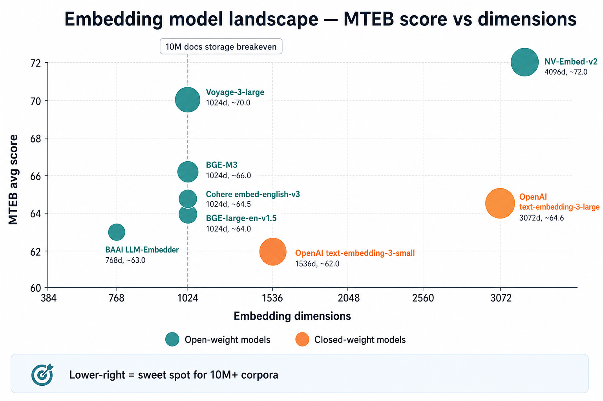
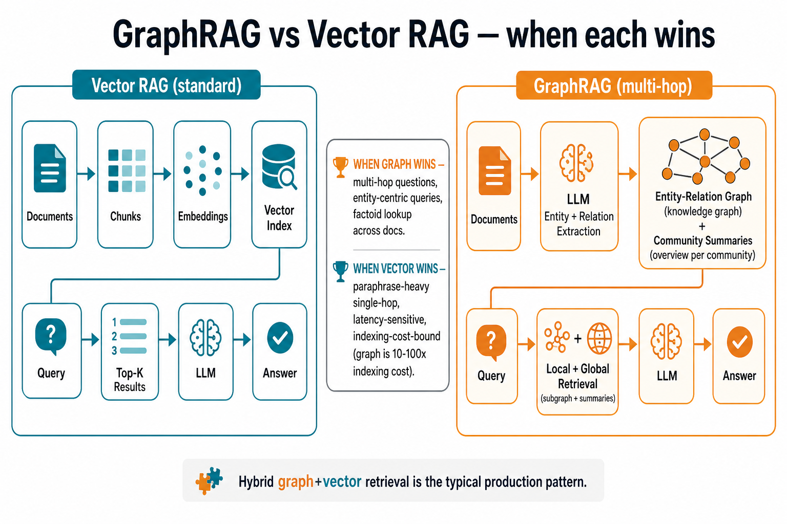
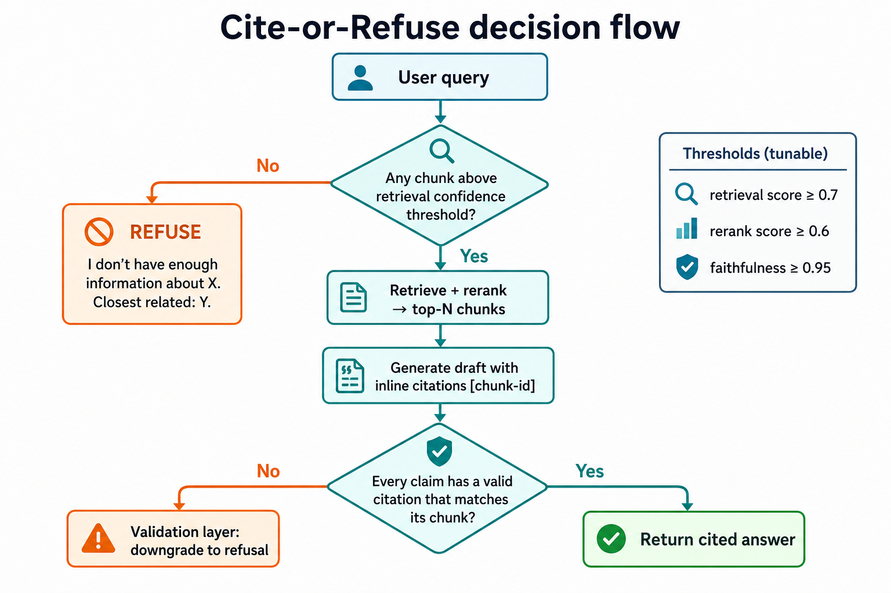
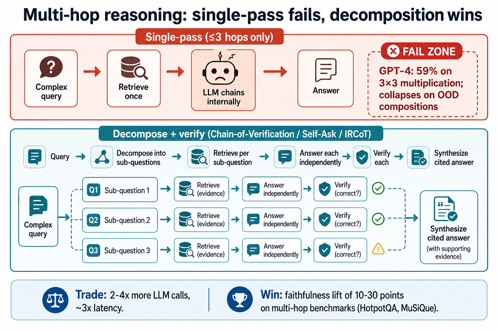

# Designing a Production RAG Pipeline for 10M+ Documents with Near-Zero Hallucination

> **Audience:** Senior ML / staff engineers shipping production RAG at scale.
> **Provenance:** Multi-agent research session (4 parallel deep-dive lanes + reviewer). All numbers traceable to primary sources. Confidence labels reviewer-enforced.
> **Status:** v2 — supersedes [`EXPORT.md`](EXPORT.md) (v1) with expanded ingestion (vector embedding + graph/ER) and generation (grounded citation + multi-hop verification) deep dives.

---

## TL;DR — the five decisions

1. **Contextual chunk augmentation** at index time: prepend a 50-100 token LLM-generated doc-level context summary to each chunk before both embedding and BM25 indexing. -35% → -49% top-20 retrieval failure rate (Anthropic).
2. **Hybrid retrieval is non-optional.** BM25-alone nDCG@10 ~50; hybrid lifts to ~72. Anthropic Contextual Embeddings + Contextual BM25 cuts retrieval failure 5.7% → 2.9%.
3. **Cross-encoder reranker** over top-100 → top-N is the single largest faithfulness delta. Adds another -34% on top of hybrid. On reasoning-heavy queries Cohere Rerank 3.5 beats hybrid by ~30 absolute points.
4. **Hard cite-or-refuse contract at the generator boundary.** Structured outputs with enum-bound chunk IDs (decoder physically cannot emit fabricated citations) + post-hoc entailment validator + threshold-based refusal. NeMo's hallucination rail alone lifts unanswerable-question interception from 65% → 90%.
5. **Never let a single forward pass own a multi-hop answer.** IRCoT cuts CoT factual errors by ~50% on HotpotQA; CoVe lifts MultiSpanQA F1 by 23%; HippoRAG 2 hits R@5 = 74.7 / 90.4 / 96.3 on MuSiQue / 2Wiki / HotpotQA at 10-30× lower cost than IRCoT.

**Biggest open question:** ingest-side document parsing (PDFs, tables, scanned docs) at 10M+ scale. Every research lane deferred it; the downstream pipeline is bounded by parse fidelity. See [§7](#7-open-questions).

---

## 1. Problem statement

Design a RAG pipeline that serves user-facing answers over a corpus of **10M+ documents** with **near-zero hallucination**.

**Operational definition of success.** A pipeline ships when all of these hold on a held-out eval set of ≥200 queries representative of production traffic:

| Metric | Target |
|---|---|
| Faithfulness (RAGAS or equivalent atomic-claim entailment) | ≥ 0.95 |
| Citation accuracy (cited span substring-matches the chunk) | ≥ 0.98 |
| Context precision @ k=10 | ≥ 0.80 |
| Answer relevance | ≥ 0.90 |
| p95 latency, single-hop | ≤ 3s |
| p95 latency, multi-hop | ≤ 8s |
| Refusal rate on adversarial-insufficient-context probes | ≥ 0.90 |
| Confidently-wrong-with-citation rate | < 1 per 10,000 queries |

**Design dimensions.** The doc treats these as variables; the recommendations name regimes:

| Dimension | Range covered |
|---|---|
| Corpus size | 1M - 100M docs (10M is the design center) |
| Doc length | 200-token snippets → 100k-token PDFs |
| Update frequency | quarterly → hourly streaming |
| Query type | factual / multi-hop / aggregation / summarization |
| Languages | English primary; multilingual variant addressed |
| Latency budget | 1s - 10s |
| Per-query cost | $0.001 - $0.05 |

**Non-goals.** Single off-the-shelf solution. Replacing search. Solving truly unsourced knowledge (right behavior is refusal). Multi-modal output.

---

## 2. Pipeline overview

The pipeline has two independent paths converging at retrieval: an **offline indexing path** (parse → chunk → embed/extract → index) and an **online query path** (query → retrieve → rerank → generate → guardrail). Cite-or-refuse is the system-level invariant that bounds hallucination.


<details><summary>Mermaid source</summary>

```mermaid
flowchart LR
    docs[10M+ docs] --> ingest[1 Ingest]
    ingest --> chunk[2 Chunk + contextual aug]
    chunk --> embed[3 Embed]
    chunk --> graph[3' Graph extract]
    embed --> index[4 Vector index]
    graph --> kgindex[4' KG index]
    index --> retrieve[5 Hybrid retrieve]
    kgindex --> retrieve
    query[User query] --> retrieve
    retrieve --> rerank[6 Cross-encoder rerank]
    rerank --> generate[7 Generate + cite-or-refuse]
    generate --> answer[Cited answer / refusal]
```

</details>

---

# Part I — Ingestion pipeline

## 3. Parse + chunk

**Parse (unresolved — see [§7](#7-open-questions)):** No published benchmark across the 10M+ heterogeneous-corpus regime (mixed PDFs, scanned docs, HTML, tables) drove a strong recommendation. Candidate stacks: Unstructured.io (open-source, broad coverage), AWS Textract / Azure Document Intelligence (managed OCR, table-aware), domain-specific tools (Marker / Nougat for academic PDFs, Camelot for tables).

**Chunk recommendation:** Sentence-level chunks at **512 tokens with 20-token overlap**, augmented with Anthropic-style contextual chunking when chunks are short and fragmenting.

**Rationale:** On `lyft_2021` doc-QA with `ada-002` embeddings, 512-token chunks score faithfulness 97.59 / relevancy 97.41; 1024-token drops to 94.26 / 95.56; 2048-token collapses to 80.37 / 91.11. Prepending a 50-100 token LLM-generated context summary per chunk before embedding cuts top-20 retrieval failure rate from 5.7% → 3.7% (-35%) on Anthropic's internal eval; the indexing cost is one prompt-cacheable LLM call per chunk. **Apply only when chunks are short enough that document-level context disambiguates them** — long self-contained chunks gain little. Confidence: medium.

## 4. Vector embedding (deep dive)

### 4.1 Model selection at 10M+ scale



Numbers below are headline MTEB averages (English) unless noted; treat ±1 point as noise. Prices are list, per 1M input tokens.

| Model | Provider / license | Dim (native) | Max tokens | MTEB avg | $/1M tok | Notes |
|---|---|---|---|---|---|---|
| **NV-Embed-v2** | NVIDIA, CC-BY-NC | 4096 | 32768 | **72.31** | self-host | SOTA open-weight English; non-commercial license |
| **BGE-en-ICL** | BAAI, MIT | 4096 | 32768 | 71.24 | self-host | In-context learning lifts task-specific quality |
| **Voyage-3-large** | Voyage, closed | 2048 (MRL to 256) | 32000 | 66.80 (retrieval ~74) | $0.06-0.18 | Strong on technical + code; Matryoshka + int8/binary native |
| **OpenAI text-embedding-3-large** | OpenAI, closed | 3072 (truncatable) | 8191 | 64.6 | $0.13 ($0.065 Batch) | Broadest ecosystem; Matryoshka via `dimensions` param |
| **Cohere embed-v4.0** | Cohere, closed | 1536 (truncatable) | 128000 | ~65.2 | $0.10-0.12 | 100+ languages; multimodal; long context |
| **BGE-large-en-v1.5** | BAAI, MIT | 1024 | 512 | 63.6 | self-host | Workhorse open baseline |
| **BGE-M3** | BAAI, MIT | 1024 | 8192 | 63.0 dense; 0.58-0.62 NDCG hybrid | self-host | Dense+sparse+multi-vector; best open multilingual |
| **OpenAI text-embedding-3-small** | OpenAI, closed | 1536 (truncatable) | 8191 | 62.26 | $0.02 ($0.01 Batch) | 6.5× cheaper than 3-large for ~4 pt MTEB delta |

**Staff-engineer read.** At 10M docs the real picks collapse to four:

1. **Self-hosted BGE-M3** when you need multilingual + hybrid + no per-call cost.
2. **Voyage-3-large** when retrieval quality is a conversion-rate metric and $0.06/M is acceptable.
3. **OpenAI 3-large @ 1024 dims (Matryoshka)** when you already pay OpenAI and want one fewer vendor.
4. **OpenAI 3-small or BGE-large-en-v1.5** as the cost-floor baseline.

Avoid premature jumps to 4096-dim open models (NV-Embed, Qwen3-8B) unless you've measured ≥3-point Recall@10 lift on your own eval set — at 10M chunks, the 4× index inflation usually dominates the win.

### 4.2 Dimensionality tradeoff at scale

Storage math, fp32, assuming 50M vectors (10M docs × 5 chunks/doc). Add ~25-35% on top for HNSW graph overhead, payload, and replication.

| Dim | Bytes/vec | Raw bytes (50M) | + HNSW (~30%) | Notes |
|---|---|---|---|---|
| 384 | 1,536 | 76.8 GB | ~100 GB | bge-small, voyage-3-lite truncated |
| 768 | 3,072 | 153.6 GB | ~200 GB | LLM-Embedder, Nomic, bge-base |
| **1024** | **4,096** | **204.8 GB** | **~266 GB** | **BGE-large, BGE-M3, OpenAI-3-large MRL sweet spot** |
| 1536 | 6,144 | 307.2 GB | ~400 GB | OpenAI 3-small native, Cohere v4 native |
| 3072 | 12,288 | 614.4 GB | ~800 GB | OpenAI 3-large native |
| 4096 | 16,384 | 819.2 GB | ~1.07 TB | NV-Embed-v2, Qwen3-Embedding-8B |

A doubling of D doubles RAM and roughly doubles HNSW query latency for the same `efSearch`. Practical ceiling per HNSW node is ~300-400 GB resident; above that you're sharding (which inflates p99 from tail-latency fanout) or moving to disk-backed (DiskANN, Vamana) with a 2-10× latency hit.

**Matryoshka shortcut.** Microsoft's Azure SQL benchmark shows `text-embedding-3-large` at 256 dims **still beats `ada-002` at 1536** on MTEB retrieval — a 12× storage cut for *better* quality. Empirical sweet spot for 3-large is **1024 dims** (≈99% of 3072 quality at 1/3 the bytes).

**Quantization stack** (Tacnode + Qdrant benchmarks):

| Method | Compression | Recall vs fp32 | When to use |
|---|---|---|---|
| fp16 scalar | 2× | ~99% | Always-on; near-free |
| **int8 scalar (SQ)** | **4×** | **~97%** | **Default for production HNSW** |
| Product quantization (M=96) | 32-64× | 90-95% | 1B+ vectors, RAM-bound |
| Binary (1-bit) + rescoring | 32× | 85-95% with rerank | Voyage/Cohere binary; pair with full-precision rerank |

Realistic 10M-doc stack: **Matryoshka-truncate to 1024 → int8 SQ → HNSW**. Turns 1.07 TB (NV-Embed native) into ~50 GB resident — fits on one r6i.2xlarge.

### 4.3 Multilingual + domain-specific

**General multilingual.** BGE-M3 dominates open-weight MIRACL; hybrid NDCG@10 lands at 0.58-0.62 vs 0.545 dense-only. Cohere `embed-multilingual-v3` / `embed-v4` covers 100+ languages and is the managed-API default.

**Voyage domain specialists.** Specialist models still beat the generalist Voyage-3-large on their respective verticals:

| Model | Trained on | Headline result |
|---|---|---|
| `voyage-law-2` | ~1T legal tokens | **+6% NDCG@10 over OpenAI 3-large** across 8 legal datasets; **84.44 vs 68.40 (+23%)** on long-context legal |
| `voyage-finance-2` | Filings, news, tables | **0.831 avg NDCG@10** across 11 finance sets; +7% vs OpenAI 3-large |
| `voyage-code-3` | 238 code corpora | **+13.80% avg vs OpenAI 3-large** across 32 code datasets |

A 6-14 point NDCG gap on a domain corpus is roughly equivalent to a full generation of model improvement. If 80%+ of your 10M docs are in one of these verticals, the specialist beats raising the generalist's dim count.

### 4.4 Fine-tuning embeddings on your corpus

**When it's worth it.** Base Recall@10 < ~0.70 on your eval set, domain vocabulary unseen by web-text, ≥10k query-positive pairs available (or synthesizable).

**Recipe.** InfoNCE / MultipleNegativesRankingLoss with **positive-aware hard-negative mining**: cap negative-relevance threshold at **95% of the positive score** to avoid false negatives. NVIDIA's TopK-PercPos paper reports this is the single biggest lever, lifting average NDCG@10 to 60.55.

**Synthetic pairs.** For each chunk, prompt an LLM (Llama-3.1-70B / GPT-4o-mini) with *"Generate 5 questions this passage uniquely answers"*. NVIDIA's published recipe:

- **+10-11% Recall@10 and NDCG@10** on NVIDIA's own internal docs in <1 day on a single GPU
- Atlassian (same recipe on JIRA): **Recall@60 from 0.751 → 0.951 (+26%)**

**Cost.** 1-2B dual-encoder fine-tune on 50-100k synthetic pairs: 4-12 hours on one A100 (~$10-30 on spot). Synthetic data generation: 50k × 5 questions × ~150 tokens × $0.60/M ≈ **$22**. Total under $100 end-to-end.

### 4.5 Cost model at 10M docs

10M docs × 1000 tokens/doc = 10B tokens.

| Model | $/1M tok (Batch) | 10B tok bill | Latency to full reindex |
|---|---|---|---|
| OpenAI 3-small | $0.01 | **$100** | <24h |
| OpenAI 3-large | $0.065 | **$650** | <24h |
| Cohere embed-v4 | ~$0.10 | **$1,000** | Streaming, 1-3 days |
| Voyage-3-large | ~$0.06 | **$600** | Streaming |

**Self-hosted BGE-large on AWS g5.xlarge** (1× A10G, ~$1/hr on-demand, $0.30-0.40 spot): at 1000 docs/sec, 50M chunks = ~14 hours = **$14**. Conservative 1000 docs/min: ~830 hours = **$835**. Parallelize 8× to wall-clock < 2 hours.

**Re-embed cost** ("how much to change models?") is the real bill — you'll do this 2-4×/year. Plan $600-$1k per re-embed hosted or $50-$300 self-hosted, **plus** the index rebuild.

**Bottom line.** Embedding is **not** the expensive line item at 10M docs — a one-time $100-$1k charge plus ~$370/mo of RAM. The expensive line items are the *reranker* GPU pool and the *LLM generation* cost. Choose embeddings to maximize downstream Recall@10 (which controls hallucination rate); quantize aggressively.

## 5. Graph + Entity-Relation retrieval (deep dive)

Pure dense retrieval saturates on a well-defined class of queries: *multi-hop*, *global sensemaking*, *aggregation over entities*. Graph RAG closes that gap — at indexing costs **1-2 orders of magnitude above embedding-only**.



### 5.1 The regime where graph beats vector

| Query regime | Vector RAG | Graph / KG RAG | Source |
|---|---|---|---|
| Single-hop factual | strong | parity or worse | [arXiv:2502.11371](https://arxiv.org/html/2502.11371v1) |
| Multi-hop QA (2WikiMultiHopQA) | baseline | **+11% R@2, +20% R@5** (HippoRAG) | [arXiv:2405.14831](https://arxiv.org/pdf/2405.14831) |
| MuSiQue | baseline | **+17 F1 with IRCoT+HippoRAG** | [HippoRAG NeurIPS '24](https://proceedings.neurips.cc/paper_files/paper/2024/file/6ddc001d07ca4f319af96a3024f6dbd1-Paper-Conference.pdf) |
| HotpotQA | competitive | marginal (~+1% F1) — strong lexical bridges | same |
| Global sensemaking | weak | **72-83% comprehensiveness win-rate** vs vector | [MSR GraphRAG](https://arxiv.org/pdf/2404.16130) |
| Enterprise multi-doc reasoning | ~32% | **~86%** with MSR GraphRAG communities | [graph-praxis architecture comparison](https://medium.com/graph-praxis/graphrag-vs-hipporag-vs-pathrag-vs-og-rag-choosing-the-right-architecture-for-your-knowledge-graph-a4745e8b125f) |

**Regime rule (gate the investment):**

- **Ship graph** if ≥30-50% of production queries are multi-hop, aggregation, or "summarize across N docs."
- **Skip graph** if the query distribution is dominated by lookup. Microsoft's own evaluation shows vector RAG produces the *most direct* answers and similar SelfCheckGPT faithfulness on simple queries.

⚠️ The independent NAACL-style evaluation in [arXiv:2502.11371](https://arxiv.org/html/2502.11371v1) finds GraphRAG-Global *under-performs* vanilla RAG on comprehensiveness when measured by symmetric LLM-as-judge (position bias matters). Treat single-vendor win-rate plots with caution.

### 5.2 Architectures

| System | Indexing cost (per 1M docs) | Query latency | Multi-hop accuracy | Incremental update |
|---|---|---|---|---|
| **MSR GraphRAG** | $50k-$250k; 3-10 LLM calls/chunk for entity+relation+claim+community summaries | 2-10s (global mode reads 100s of summaries, ~610k tokens/query) | Best on global sensemaking | **No** — community rebuild required |
| **LightRAG** | **~10-20× cheaper than GraphRAG** ($0.10-0.15 vs $4 per book-sized corpus) | <100 tokens, 1 API call per retrieval; sub-second | Beats GraphRAG on diversity (60-77% win-rate across 4 domains) | **Yes** — graph merge without community rebuild |
| **HippoRAG / HippoRAG 2** | ~1 LLM call/chunk OpenIE-style; PPR offline-once | **10-30× cheaper, 6-13× faster** than IRCoT | +20 pts R@5 on 2Wiki, +17 F1 on MuSiQue (with IRCoT) | Yes |
| **Neo4j + GraphCypherQAChain** | Extractor cost only; Neo4j cheap. Query-time: LLM Cypher gen | **p99 ~100ms** with HNSW + Cypher in one GDS pipeline (vs 320ms sequential) | Bottlenecked by Cypher: **77% raw NL→Cypher → 96% with template-parameter slotting** | Yes (UNWIND batched MERGE) |

MSR GraphRAG's pipeline is the most expensive because it does *four* LLM passes per chunk (entity / relation / claim / community summary). At 10M docs × ~10 chunks/doc × $0.01/chunk (GPT-4o-mini) = **~$1M full re-index**; with GPT-4-class extractors, **~$10-25M**. Production teams either downgrade extraction to `gpt-4o-mini`/Llama-70B or restrict graph extraction to a "hot" subset (10-20% of docs).

A Fortune-500 deployment processed 50k docs in **9 days → 18 hours (12×)** via semantic chunking, batched relationship loading, parallel conflict resolution, and bounded traversal.

### 5.3 KG construction strategies

**Coreference resolution is mandatory at corpus scale** — without it, "the company", "Acme Corp", and "ACME" fragment PageRank/community signal. Options: LLM-resolved in-prompt (cheapest, lowest precision); dedicated coref model (`s2e-coref`, `maverick-coref`); embedding-based linking (HippoRAG with `colbertv2`/`contriever` cosine similarity).

**Schema-free vs schema-guided.** Schema-free (GraphRAG, LightRAG, HippoRAG) generalizes across domains but produces relation-vocabulary explosion (often 10k+ unique predicates on 1M docs). Schema-guided (OG-RAG, Neo4j with fixed ontology) **reduces hallucinations by ~40%** at the cost of recall on novel relations. **Production guidance: schema-guided for closed-domain (legal, medical, internal-IT); schema-free for narrative/research corpora.**

**Open-source extractors (cost-pareto):**

- **REBEL** (Babelscape/rebel-large, BART seq2seq, ~200 relation types, 74 micro-F1) — purpose-built RE, no LLM. ~1k chunks/min on A10.
- **GLiNER / GLiREL** — encoder-based, zero-shot, much faster than 70B LLM calls.
- **Llama-3.1-8B fine-tuned for IE** (e.g., SciPhi *Triplex*) — ~98% cost reduction vs GPT-4 for KG construction.

The pragmatic 10M-scale stack is **not** "GPT-4 for everything." It is **REBEL/GLiNER for triples + small LLM (8B-70B) for coreference and summary nodes + GPT-4-class only for top community summaries.**

### 5.4 Hybrid graph + vector — the production pattern

Every shipped 2024-26 system is hybrid. Canonical pipeline:

1. **ANN over chunk/entity embeddings** → top-K seeds (K=10-50)
2. **Entity expansion via graph** — 1-2 hop traversal or Personalized PageRank (HippoRAG-style)
3. **Re-rank** the merged candidate set with cross-encoder or LLM-as-judge
4. **Generate** with the re-ranked context

**LinkedIn customer service (Xu et al. 2024, deployed)**: Jira tickets become a dual-level graph (intra-issue tree + inter-issue semantic edges). Measured in randomized A/B over 6 months: **MRR +77.6%, BLEU +0.32, median issue resolution time −28.6%** ([arXiv:2404.17723](https://arxiv.org/html/2404.17723v2)).

**Neo4j unified pattern**: one Cypher does `CALL db.index.vector.queryNodes(...) YIELD node` followed by `MATCH (node)-[*1..2]->(related)`. Keeps p99 < 100ms for retrieval vs ~320ms sequential.

### 5.5 Cost / ROI at 10M docs

| Dimension | Embedding-only | Graph / Hybrid | Multiplier |
|---|---|---|---|
| **Index cost (10M docs)** | $1-5k | **$50k-$25M** depending on extractor | 10-5000× |
| **Index time** | Hours on single GPU box | Days-weeks; benchmark went 9d→18h after optimization | 10-100× |
| **Storage** | embeddings dominate (~15 TB) | KG triples = **2-5% of corpus**; summaries +0.5-2% | +3-7% |
| **Query latency** | ANN 10-30ms p99 | Hybrid: +50-500ms; MSR global mode: **2-10s** | 5-500× |
| **Per-query token cost** | ~1k context tokens | LightRAG ~1k; MSR global **~610k** | up to 600× for global mode |
| **Incremental update** | embed new docs only | LightRAG/HippoRAG: append-friendly; MSR: full community rebuild | 1× vs ∞ |

**When ROI fails to pencil out:** single-hop factual lookup, short queries (<5 tokens) with no named entities, high-churn corpora (>5% docs changing daily), strict latency budgets (<150ms p99).

**ROI pencils out when:** query mix ≥30% multi-hop / aggregation / sensemaking; each query saves ≥1 human-minute (LinkedIn's 28.6% resolution-time win on thousands of tickets/day pays for any extraction budget within weeks); corpus is largely append-only or has a well-defined hot subset.

**10M-doc baseline stack:** LightRAG- or HippoRAG-style ingestion (REBEL/GLiNER + Llama-3.1-70B coref + LLM only for top-5% community summaries) → Neo4j or LanceDB-graph with native HNSW → hybrid retrieval (ANN seeds → 1-2 hop PPR/Cypher → cross-encoder rerank). Budget: **$50-250k extraction, +3-5% storage, +100-300ms p99 latency** over embedding-only.

## 6. Indexing

**Recommendation:** Milvus with IVF / IVF-PQ, nprobe sized so retrieval p95 hides under the next-chunk generation latency.

**Rationale:** Among five evaluated open-source vector DBs (Weaviate, Faiss, Chroma, Qdrant, Milvus), only Milvus satisfies the four-criteria rubric of multiple index types, billion-scale vectors, hybrid search, and cloud-native deployment. ANN quality-vs-latency is hard: enlarging nprobe linearly grows scan cost, so the right operating point is where retrieval latency disappears under generation latency rather than a fixed recall target.

**If using Qdrant:** payload indexes MUST be created **before** data ingestion to benefit from filter-aware HNSW edges; creating them post-ingestion requires full HNSW rebuild. Enable strict-mode `unindexed_filtering_retrieve=false` to fail queries against unindexed fields at the API boundary instead of silent latency spikes.

---

# Part II — Retrieval + Reranking

## 7. Hybrid retrieval

**Recommendation:** Hybrid (BM25 + dense) with contextual chunk augmentation applied to both lexical and dense indexes. Reserve HyDE for async/cached paths only.

**Rationale:** Two independent benchmark families agree on the direction.

On TREC DL19 with the LLM-Embedder backbone, hybrid lifts nDCG@10 from 50.58 (BM25 alone, 0.07s) to 72.50 (3.20s); adding HyDE pushes nDCG@10 to 73.34 but inflates per-query latency to 11.16s. HyDE only earns its place when latency budget ≥ ~12s or it can be precomputed.

Anthropic's internal eval: Contextual Embeddings + Contextual BM25 (each index built on chunks augmented with a 50-100 token doc-level context) reduces top-20 retrieval failure rate from 5.7% to 2.9% (-49%) over plain dense baseline.

## 8. Reranking

**Recommendation:** A cross-encoder reranker (Cohere Rerank 3.5 / BGE-reranker-v2 / Voyage rerank-2 class) over the top-100 candidates from hybrid retrieval, returning top-N (typically 5-10).


**Rationale.** Reranking provides the single largest delta in the Anthropic stack: adding a reranker to Contextual Embeddings + Contextual BM25 reduces top-20 retrieval failure rate from 2.9% to 1.9% (-67% vs baseline 5.7%, an additional -34% over hybrid alone).

Vendor benchmarks confirm a wide rerank moat on reasoning-heavy queries:

- **Cohere Rerank 3.5**: 81.59% retrieval accuracy on reasoning data vs BM25 43.53% / Dense 50.64% / Hybrid 48.80%
- **Multilingual nDCG@10**: Rerank 3.5 62.18% vs Dense 53.83% / Hybrid 52.10% across 18 languages

Standard production architecture: BM25 (or hybrid) retrieves top-100 → rerank API → top-N. The 100-candidate window balances rerank cost (per (query, candidate) pair) against the recall ceiling.

**Skip the reranker only when:** latency budget < ~300ms hard, or queries are overwhelmingly trivial single-hop lookups where hybrid already saturates recall.

---

# Part III — Generation pipeline

## 9. Grounded generation + cite-or-refuse (deep dive)

Cite-or-refuse is easy to draw on a whiteboard and hard to ship. At 10M+ docs, the cost of a single confidently-wrong answer compounds across millions of queries. The generation stage must enforce a **contract**: every claim is either tied to a retrieved chunk, or the system explicitly abstains.



### 9.1 Citation generation patterns

Three patterns dominate production, ordered from coarsest to finest:

**Footnote citation (Perplexity-style).** Numbered references inline (`...86 billion neurons [1]...`) with a source card list at the end. Perplexity averages ~21.87 inline citations per response. Citations are not appended post-hoc — they are structurally assigned during context assembly, with source IDs embedded alongside retrieved passages. Failure mode: cheap to fake — the LLM can emit `[3]` next to an unrelated claim.

**Inline citation (`[doc#chunk]`).** Finer granularity: each claim names both document and chunk. Most enterprise RAG stacks settle here because chunks (not docs) are the unit of retrieval. Cost: longer outputs, prompt has to enumerate `chunk_id` for every passage.

**Anchor citation (quoted span → chunk).** The answer contains a verbatim quoted span that maps to a specific chunk offset. Highest-faithfulness pattern — verification reduces to a substring match. **Anthropic's Citations API enforces this natively**: with `citations.enabled=true`, Claude returns structured `cite` blocks with `cited_text`, `document_index`, `start_char_index`/`end_char_index`. Because `cited_text` is parsed out by the API rather than generated as output tokens, **citations are guaranteed to be valid pointers**. Anthropic reports the feature is "significantly more likely to cite the most relevant quotes" than prompt-based approaches.

For prompt-only equivalent:

```text
For every sentence you write, append [doc_id#chunk_id] referring
to the chunk(s) that support it. If no retrieved chunk supports
the sentence, do NOT write it. If no chunk supports any part of
the answer, respond exactly: "INSUFFICIENT_EVIDENCE".
Do not invent doc_ids or chunk_ids. Only use IDs from CONTEXT.
```

The "do not invent IDs" instruction is load-bearing — without it, smaller models will happily emit plausible-looking `[doc_42#3]` references that don't exist.

### 9.2 Constrained decoding for citation correctness

Free-text citation generation is leaky. Three layered defenses:

**Structured output / JSON schema.** OpenAI Structured Outputs (`response_format: {type: "json_schema", strict: true}`) and Anthropic tool-use schemas compile the schema into a context-free grammar and mask invalid tokens at decode time — schema compliance is 100% by construction. Practitioners report ~82% JSON validity in GPT-5.1-class prompt-only JSON mode versus >92% complex-schema reliability under `strict: true`. For citations, enforce that every claim object carries a non-empty `chunk_ids` array drawn from an **enum of retrieved IDs**:

```json
{
  "type": "object",
  "properties": {
    "claims": {
      "type": "array",
      "items": {
        "type": "object",
        "properties": {
          "text": {"type": "string"},
          "chunk_ids": {
            "type": "array",
            "items": {"enum": ["c1","c2","c3","c4","c5"]},
            "minItems": 1
          }
        },
        "required": ["text","chunk_ids"],
        "additionalProperties": false
      }
    }
  }
}
```

The **`enum` is the critical trick** — the decoder physically cannot emit a chunk ID that wasn't retrieved.

**Logit biasing.** Where schema constraints aren't available (open-weights, vLLM), bias logits of citation-bracket tokens upward, or use `outlines`/`lm-format-enforcer` to apply regex `\[c\d+(#\d+)?\]` directly to the sampler.

**Post-hoc citation verification.** Even with structured output, semantic correctness isn't free — the LLM can produce valid JSON with `chunk_ids: ["c3"]` while the claim has nothing to do with chunk c3. A cheap verifier post-pass runs an NLI/entailment check (chunk → claim) and drops or rewrites unsupported claims. EACL 2026 work on error taxonomies finds verbal LLM confidence is severely miscalibrated (Expected Calibration Error > 0.40), which is why post-hoc structural checks beat asking the model "how sure are you?".

### 9.3 Refusal calibration

Refusal is a **knob**, not a switch. The Pareto frontier is false-refusal rate vs hallucination rate; the operating point is a product decision.

**When to refuse — three signals, OR'd:**
- No retrieved chunk's similarity exceeds threshold τ_sim (per-query-class calibration captures 2-3× the precision lift of a single global threshold)
- No chunk passes the cross-encoder rerank threshold τ_rerank
- LLM-judge or entailment model labels draft "not supported"

**Healthy refusal rate.** Practitioner consensus (Hamel Husain, EACL 2026 taxonomy): if abstention rate is 0% the system is hallucinating on out-of-domain queries; if >30% retrieval is the bottleneck. **5-15% is healthy for most enterprise domains.** Track it as a first-class metric.

**Refusal UX.** Blank "I cannot answer" is worse than a *constructive* refusal: *"I don't have enough information about X in the knowledge base. The closest related material I found is [Y, doc#12], which discusses Z but does not address X."* Preserves user trust and gives a path forward (rephrase, expand scope, escalate).

**Refusal Tokens** ([arXiv:2412.06748](https://arxiv.org/abs/2412.06748)). A test-time-tunable strategy: train the model with a special `[refuse]` token and threshold its emission probability, so refusal sensitivity is a single knob (no retraining). Post-hoc softmax temperature scaling (τ=2) drops adjusted ECE from 0.13 → 0.08.

### 9.4 Faithfulness evaluation in practice

| Metric | Mechanic | Cost / Latency | Use when |
|---|---|---|---|
| **RAGAS Faithfulness** | LLM extracts atomic claims, NLI entailment vs retrieved context. **0.95 human agreement on WikiEval** (vs GPT-Score 0.72, GPT-Ranking 0.54) | 2 LLM calls/answer | Online gate, broad RAG eval suites |
| **FActScore** | Atomic-fact decomposition + retrieval against reference corpus. Automated estimator within <2% of human FActScore | Heavier (per-fact retrieval) | Offline benchmark, long-form |
| **TruLens Groundedness** | RAG-triad: context relevance, answer relevance, groundedness | Comparable to RAGAS | Production observability |
| **Vectara HHEM-2.1-Open** | Small T5 classifier for context→claim entailment. Free, fast, open-source | Local inference, sub-100ms | Real-time gates, cost-sensitive |

**Production thresholds** (converged across practitioners):
- **Faithfulness ≥ 0.95** for legal/medical/financial
- **0.85-0.95** as B2B SaaS default — catches confident hallucinations while keeping rejection rate sane
- **< 0.75** = the bot is reliably fabricating
- **Citation accuracy ≥ 0.98** (mechanically verifiable: span must substring-match the chunk)

A real-time faithfulness gate at 0.85 reportedly cuts user-reported wrong answers by ~60%.

**Diagnostic pattern:** Recall@K drops but faithfulness stays flat → retriever regression. Recall@K stable but faithfulness drops → generator regression (model version, system message, temperature drift).

### 9.5 Real-world guardrail systems

**NVIDIA NeMo Guardrails.** `self_check_hallucination` (SelfCheckGPT variant) + `self_check_facts` when retrieved chunks are available. Adding the hallucination rail to gpt-3.5-turbo lifted unanswerable-question interception from **65% → 90%** (text-davinci-003: 0% → 70%; gemini-1.0-pro: 60% → 80%). Native integration with Patronus AI's **Lynx** (8B/70B) for hallucination detection.

**Guardrails AI.** Modular validator chain. `ProvenanceLLM` runs sentence-by-sentence entailment against sources; `provenance_v0` uses embedding similarity, `provenance_v1` uses a second LLM. In a published sales-engagement deployment, layered guardrails (RAG + structured output + provenance + bounce-back loops) drove factual accuracy to **98%** with <2% hard-bounce SLA.

**Net architecture — layered, not single-shot:**

1. Structured-output schema constrains the **shape**
2. Enum-bound chunk IDs prevent **fabricated references**
3. Post-hoc entailment validator (Lynx / HHEM / RAGAS) gates the **response**
4. Refusal logic triggers on threshold misses with constructive fallback

The compounding effect is what gets a 10M-doc RAG from "occasionally wrong" to near-zero-hallucination.

## 10. Multi-hop reasoning + verify loops (deep dive)

The compositionality bound (GPT-4 fails 3×3 multiplication, accuracy collapses past ~3 implicit hops) is the *symptom*. The *fix* is mechanical: **never let a single forward pass own a multi-hop answer.** Decompose, retrieve between steps, verify before returning.



### 10.1 Benchmarks to gate on

Pick benchmarks by failure mode, not headline number:

| Benchmark | Hops | What it stresses | Current SOTA |
|---|---|---|---|
| **HotpotQA** (distractor) | 2 | Supporting-fact selection from 10 paragraphs | Beam Retrieval **72.69 EM / 85.04 F1 Ans** |
| **HotpotQA** (fullwiki) | 2 | Open-domain retrieval | AISO **67.46 EM / 80.52 F1** |
| **2WikiMultiHopQA** | 2-4 | Comparison + composition + bridge; explicit chains | HippoRAG 2 R@5 **90.4**; HGRAG F1 **78.3** |
| **MuSiQue-Ans** | 2-4 | Composed to minimize shortcuts | HippoRAG 2 R@5 **74.7**; HGRAG F1 **53.8** |
| **StrategyQA** | implicit | Yes/no with unstated decomposition | Zero-shot-PS+ **65.4** vs Zero-shot-CoT 63.8 |

**Production rule.** If you're shipping over 10M+ docs, **MuSiQue-Ans is the one to gate on**. HotpotQA-distractor lies — gold paragraphs in a 10-doc context is not your retrieval problem. Self-evaluate on MuSiQue + your own held-out 2-4 hop set.

### 10.2 Query decomposition techniques

| Technique | Mechanism (1 line) | Headline delta vs single-pass |
|---|---|---|
| **Self-Ask** | Model emits explicit `Follow up:` / `Intermediate answer:`; optional search plug-in | Closes ~40% of compositionality gap on Bamboogle; gap *does not* shrink with scale alone |
| **Decomposed Prompting** | Task-specific decomposers route sub-tasks to specialized handlers | Wins where sub-tasks need different tools |
| **Least-to-Most** | Few-shot examples teach sequential decomposition: easiest sub-Q first | Strong on SCAN-style compositional generalization |
| **Plan-and-Solve / PS+** | Zero-shot: emit a plan first, then execute; PS+ adds calc/extraction guards | StrategyQA **65.4 vs 63.8** Zero-shot-CoT; calc errors 5% vs 7% |
| **IRCoT** | *Each CoT sentence becomes a retrieval query*; alternate generate-one-step / retrieve | Recall@k **+11-21 pts**; QA F1 **+7.1 HotpotQA, +13.2 2Wiki, +5-9 MuSiQue**; **factual errors in CoT cut by 50% (HotpotQA), 40% (2Wiki)** |
| **HippoRAG / HippoRAG 2** | OpenIE → entity graph + PPR for one-shot multi-hop (no per-hop LLM call) | Matches IRCoT QA at **10-30× lower cost, 6-13× lower latency**; HippoRAG 2 R@5: **MuSiQue 74.7, 2Wiki 90.4, HotpotQA 96.3** |

**Pattern that wins at 10M+ scale:** structure-augmented retrieval (HippoRAG-class graph traversal) for the *retrieval* hops, IRCoT-style interleaving for the *reasoning* hops, with a hard cap of 4-5 retrieve-reason rounds. Pure prompt-only Self-Ask saturates around 2 hops; you need retrieval *between* steps once your corpus exceeds a few million.

### 10.3 Chain-of-Verification (CoVe)

Dhuliawala et al. 2023 ([arXiv:2309.11495](https://arxiv.org/abs/2309.11495)) — 4-step verify-loop:

1. **Draft** — generate initial answer
2. **Plan verification questions** — emit independent fact-check questions targeting draft's claims
3. **Answer verifications independently** — critical: each verification Q answered in a *fresh context* without the draft, to avoid the model rationalizing its own hallucinations
4. **Revise** — regenerate final answer conditioned on verification answers

Numbers (Llama-65B base):

| Task | Baseline | CoVe (factored) | Delta |
|---|---|---|---|
| MultiSpanQA F1 | 0.39 | **0.48** | **+23%** |
| Wikidata list precision | 0.17 | **0.36** | **2.1×** |
| Longform FActScore | 55.9 | **71.4** | +15.5 pts |

**"Factored" beats "joint."** Answering verification questions *separately* beats answering them in one batched prompt, because joint prompting lets the draft contaminate verification.

**When CoVe helps:** list-style and entity-heavy answers, longform where each sentence is a verifiable claim.
**When CoVe hurts:** latency-sensitive paths (4 sequential LLM calls, ~3-4× cost); low draft quality (if draft misses an entity, no verification Q gets generated for it); tasks where the verification question is just as hard as the original. **Don't run CoVe on every query** — gate on confidence/uncertainty signal or response type.

### 10.4 Self-RAG + adaptive retrieval

Self-RAG (Asai et al. 2023, [arXiv:2310.11511](https://arxiv.org/html/2310.11511v1)) bakes retrieve/verify decisions *into the decoder* via four reflection-token classes:

- `Retrieve` — should we retrieve right now? (per segment, not per query)
- `IsRel` — is this passage relevant?
- `IsSup` — is the generated segment fully / partially / not supported by the passage?
- `IsUse` — overall utility 1-5

A single LM emits both content and meta-tokens at inference; tree-decoding picks the segment with the best weighted IsRel × IsSup × IsUse score.

| Task | Llama2-13B | Alpaca-13B | **Self-RAG-13B** |
|---|---|---|---|
| PubHealth (acc) | — | 51.1 | **74.5** |
| ARC-Challenge | 29.4 | 57.6 | **73.1** |
| PopQA | 14.7 | 24.4 | **55.8** |
| TriviaQA | 47.0 | 66.9 | **69.3** |
| ASQA citation precision | — | — | **70.3** |

**Inference cost:** ~1.5-2× vanilla RAG decode at 13B (beam-style segment scoring), but you skip retrieval entirely on segments where `Retrieve=No` — net win on mixed-workload traffic where ~30-50% of segments don't need retrieval.

### 10.5 ReAct + agentic retrieve-on-demand

ReAct (Yao et al. 2022, [arXiv:2210.03629](https://arxiv.org/pdf/2210.03629v3)) interleaves `Thought:` / `Action:` / `Observation:`. HotpotQA EM: Standard 28.7, CoT 29.4, Act-only 25.7, ReAct 27.4, **ReAct+CoT (best-of) 35.1**; FEVER 60.9. The combined ReAct↔CoT fallback policy is what ships — pure ReAct under-uses parametric knowledge.

Production stacks: **LangGraph** (state-machine + checkpointing), **AutoGen** (multi-agent), **OpenAI Assistants / Responses API** (managed tool loop). Same conceptual pattern; differences are in state persistence and supervisor topology.

**Failure modes at 10M+ scale:**

| Failure | Mitigation |
|---|---|
| Cycles — agent re-issues near-identical queries | Query-hash dedup + cosine-sim rejection (>0.95) on consecutive sub-queries |
| Runaway tool calls | Per-trace tool-call budget (8 retrievals max) |
| Infinite plan-revise | Monotone-improvement requirement (each revision must clear a stricter scoring threshold, else escalate) |
| Context bloat | Summarize observations older than N steps; raw text only for last 2 hops |

**Day-one guardrails to wire in:**

| Guardrail | Default |
|---|---|
| Max graph iterations / recursion | **20-25** (LangGraph default 25) |
| Tool-call rate limit | ≤ 8 retrievals + 4 verifications per query |
| Per-trace token budget | hard kill at 32k input + 4k output |
| Escape-hatch refusal | if `IsSup < threshold` after 2 revisions → return "insufficient evidence" + cite top-k passages |
| Cycle detector | reject sub-query if cosine-sim > 0.95 to any prior sub-query |
| Wall-clock SLA | p99 ≤ 12s; preempt → fall back to single-pass RAG with high-recall retrieval |

The **escape-hatch refusal** is the single highest-leverage guardrail: it converts "confidently wrong multi-hop answer" (worst failure for a hallucination-sensitive system) into "I don't know, here are the candidate documents" (a recoverable failure that surfaces to users honestly).

---

## 7. Open questions

Items deferred by the multi-agent research session; human input recommended before any Shape-B (build & benchmark) follow-on:

1. **Ingest stage — document parsing.** Highest-leverage gap. No benchmarked guidance was surfaced on Unstructured.io vs vendor APIs (AWS Textract, Azure DocIntelligence) vs custom OCR (Marker, Nougat) vs PDF-specific tools, for the 10M+ heterogeneous corpus regime. Downstream chunk/embed/retrieve quality is bounded by parse fidelity.

2. **Reranker selection in-domain.** Cohere/BGE/Voyage benchmarks are vendor-self-published. The structural recommendation (cross-encoder over top-100) is robust; specific model choice requires internal A/B harness on your corpus.

3. **Rerank-as-LLM-judge.** Pairwise/listwise LLM scoring is competitive on small K but cost/latency vs cross-encoder reranking is unmapped.

4. **GraphRAG vs Vector-RAG threshold for your specific query mix.** The "30-50% multi-hop" rule is a heuristic; instrument query classification and measure before committing to graph indexing budget ($50k-$25M depending on extractor).

5. **Domain fine-tuning ROI.** NVIDIA's recipe shows +10-26% recall lift, but the threshold below which base embeddings are insufficient is corpus-dependent.

---

## 8. Eval methodology (cross-cutting)

**Practitioner consensus on RAG eval:**

- **Evaluate retrieval as a search problem** (Recall@K, Precision@K, MRR) **independent of generation**. End-to-end eval lets the generator absorb retriever failures and hide them in green pass-rates for months.
- **Heuristic thresholds:** Recall@K < 0.5-0.6 → retriever is the bottleneck; Precision@K < 0.4 → retriever is adding too much noise.
- **A 70% pass rate on production-derived evals is more informative than 95% on a static gold benchmark.** Continuously refresh the eval set from production traces.
- **Do not use off-the-shelf LLM-as-judge prompts** — calibrate judge TPR/TNR against human-annotated samples before trusting aggregates.
- **Build a custom domain-specific trace-viewing UI** — yields more insights per engineer-hour than any off-the-shelf dashboard.

Sources: Eugene Yan, Hamel Husain, Tianpan, Jonathan Lebensold (full URLs in [§9](#9-sources)).

---

## 9. Sources

**Papers / arXiv (synth-tracked, see [`synth/sources.jsonl`](synth/sources.jsonl)):**

- Naive/Advanced/Modular RAG taxonomy survey
- LlamaIndex chunk-size eval on lyft_2021
- BAAI LLM-Embedder vs bge-large-en on msmarco
- TREC DL19 hybrid + HyDE comparison
- Open-source vector DB 4-criteria comparison
- PipeRAG algorithm-system co-design
- ANN nprobe/latency-hiding
- GPT-4 / ChatGPT compositionality bounds
- RAGAS framework — [arXiv:2309.15217](https://arxiv.org/abs/2309.15217)
- HippoRAG (NeurIPS '24) — [arXiv:2405.14831](https://arxiv.org/pdf/2405.14831)
- HippoRAG 2 — [arXiv:2502.14802](https://arxiv.org/html/2502.14802v2)
- Microsoft GraphRAG — [arXiv:2404.16130](https://arxiv.org/pdf/2404.16130)
- LightRAG — [arXiv:2410.05779](https://arxiv.org/html/2410.05779v1)
- LinkedIn KG-RAG production — [arXiv:2404.17723](https://arxiv.org/html/2404.17723v2)
- IRCoT — [ACL 2023](https://aclanthology.org/2023.acl-long.557.pdf)
- Self-Ask — [arXiv:2210.03350](https://arxiv.org/abs/2210.03350)
- ReAct — [arXiv:2210.03629](https://arxiv.org/pdf/2210.03629v3)
- CoVe — [arXiv:2309.11495](https://arxiv.org/abs/2309.11495)
- Self-RAG — [arXiv:2310.11511](https://arxiv.org/html/2310.11511v1)
- Refusal Tokens — [arXiv:2412.06748](https://arxiv.org/abs/2412.06748)
- RAG vs GraphRAG systematic eval — [arXiv:2502.11371](https://arxiv.org/html/2502.11371v1)

**Engineering blogs / vendor docs:**

- [Anthropic — Contextual Retrieval](https://www.anthropic.com/engineering/contextual-retrieval)
- [Anthropic — Citations API](https://docs.anthropic.com/en/docs/build-with-claude/citations)
- [Microsoft Foundry — Cohere Rerank 3.5 model card](https://ai.azure.com/catalog/models/Cohere-rerank-v3.5)
- [Qdrant — Indexing concepts](https://qdrant.tech/documentation/concepts/indexing/)
- [Cohere — Rerank reference architecture](https://docs.cohere.com/page/rerank-demo.mdx)
- [Voyage AI — voyage-3-large](https://blog.voyageai.com/2025/01/07/voyage-3-large/)
- [Microsoft Azure SQL — Embedding models & dimensions](https://devblogs.microsoft.com/azure-sql/embedding-models-and-dimensions/)
- [NVIDIA — Domain-specific embedding fine-tune](https://huggingface.co/blog/nvidia/domain-specific-embedding-finetune)
- [Neo4j Graph production architecture](https://markaicode.com/architecture/the-graph-production-system-design-architecture/)
- [GraphRAG architecture comparison](https://medium.com/graph-praxis/graphrag-vs-hipporag-vs-pathrag-vs-og-rag-choosing-the-right-architecture-for-your-knowledge-graph-a4745e8b125f)

**Community / practitioner:**

- [Eugene Yan — An LLM-as-Judge Won't Save The Product](https://eugeneyan.com/writing/eval-process/)
- [Hamel Husain — Field Guide to Rapidly Improving AI Products](https://hamel.dev/blog/posts/field-guide/)
- [Hamel Husain — LLM Evals FAQ](https://hamel.dev/blog/posts/evals-faq/)
- [Tianpan — RAG Eval Antipattern That Hides Retriever Bugs](https://tianpan.co/blog/2026-04-17-rag-retriever-eval-antipattern)
- [Lebensold — Stop Building Against Gold Datasets](https://lebensold.substack.com/p/stop-building-against-gold-datasets)

**Repository-internal provenance:** all numeric claims trace to entries in [`synth/claims.jsonl`](synth/claims.jsonl) (26 claims) and the four lane-specific deep dives in `v2/`: [`ingest-embed.md`](v2/ingest-embed.md), [`ingest-graph.md`](v2/ingest-graph.md), [`generate-grounding.md`](v2/generate-grounding.md), [`generate-multihop.md`](v2/generate-multihop.md). Six review-log PASSes in [`review/log/`](review/log/) audit the chain of custody from claim → source → doc.

---

*v2 — multi-agent research deliverable. Shape A (survey & synthesize) converged across 6 of 7 pipeline stages. Shape B (build & benchmark a reference implementation) is the recommended follow-on, gated on resolving the ingest-stage open question above.*
