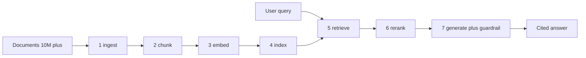

# Approach: end-to-end pipeline

> Synth writes this. The structure below is the contract. Replace `_TBD_` markers as evidence accumulates. Keep each section approach-first - rationale and tradeoffs live here; concept explanations live in [appendix/concepts.md](../appendix/concepts.md).

## Pipeline shape (7 stages)

## 1. Ingest

**Recommendation**: _TBD_

**Rationale (with regimes)**: _TBD_

**Alternatives considered**: see [doc/02-tradeoffs.md#ingest](02-tradeoffs.md#ingest)

## 2. Chunk

**Recommendation**: _TBD_

**Rationale (with regimes)**: _TBD_

**Alternatives considered**: see [doc/02-tradeoffs.md#chunk](02-tradeoffs.md#chunk)

## 3. Embed

**Recommendation**: _TBD_

**Rationale (with regimes)**: _TBD_

**Alternatives considered**: see [doc/02-tradeoffs.md#embed](02-tradeoffs.md#embed)

## 4. Index

**Recommendation**: _TBD_

**Rationale (with regimes)**: _TBD_

**Alternatives considered**: see [doc/02-tradeoffs.md#index](02-tradeoffs.md#index)

## 5. Retrieve

**Recommendation**: _TBD_

**Rationale (with regimes)**: _TBD_

**Alternatives considered**: see [doc/02-tradeoffs.md#retrieve](02-tradeoffs.md#retrieve)

## 6. Rerank

**Recommendation**: _TBD_

**Rationale (with regimes)**: _TBD_

**Alternatives considered**: see [doc/02-tradeoffs.md#rerank](02-tradeoffs.md#rerank)

## 7. Generate + guardrail

**Recommendation**: _TBD_

**Rationale (with regimes)**: _TBD_

**Alternatives considered**: see [doc/02-tradeoffs.md#generate](02-tradeoffs.md#generate)

## Hallucination control (cross-cutting)

Hallucination control is not a single stage; it spans chunking (preserve context windows), retrieval (recall floor), reranking (precision ceiling), and generation (cite-or-refuse contracts). Per-stage controls and the cross-cutting eval methodology are in [appendix/evals.md](../appendix/evals.md).

**Recommendation summary**: _TBD_

## Open questions

(synth populates from `synth/open-questions.md` issues that need human input)
