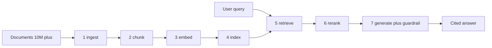

# Approach: end-to-end pipeline

> Synth writes this. The structure below is the contract. Replace `_TBD_` markers as evidence accumulates. Keep each section approach-first - rationale and tradeoffs live here; concept explanations live in [appendix/concepts.md](../appendix/concepts.md).

## Pipeline shape (7 stages)

## 1. Ingest

**Recommendation**: _TBD_

**Rationale (with regimes)**: _TBD_ — no claims in this batch (see [synth/open-questions.md](../synth/open-questions.md)). Confidence: low.

**Alternatives considered**: see [doc/02-tradeoffs.md#ingest](02-tradeoffs.md#ingest)

## 2. Chunk

**Recommendation**: Sentence-level chunks at 512 tokens with 20-token overlap.

**Rationale (with regimes)**: On lyft_2021 doc-QA with ada-002 embeddings and GPT-3.5 / Zephyr-7B generators, 512-token chunks score faithfulness 97.59 / relevancy 97.41; 1024-token drops to 94.26 / 95.56; 2048-token collapses to 80.37 / 91.11 (S-C-0003). The win regime is faithfulness-gated doc QA with sub-32k context generators; for long-context generators the gradient is likely flatter and the recommendation may shift. Single-paper single-benchmark evidence — confidence: low.

**Alternatives considered**: see [doc/02-tradeoffs.md#chunk](02-tradeoffs.md#chunk)

## 3. Embed

**Recommendation**: BAAI LLM-Embedder as default ([BGE](../appendix/concepts.md#bge) family).

**Rationale (with regimes)**: On namespace-Pt/msmarco, LLM-Embedder hits MRR@10 37.58 / R@10 66.45 versus bge-large-en at 37.66 / 66.09 — statistical wash at ~1/3 the parameter count (S-C-0004). At 10M+ corpus, the 3x size delta dominates the ~0.08 MRR@10 gap. English open-domain only; multilingual or domain-specialized retrieval (code, finance, law) is out of this evidence's regime. Confidence: low.

**Alternatives considered**: see [doc/02-tradeoffs.md#embed](02-tradeoffs.md#embed)

## 4. Index

**Recommendation**: Milvus with [IVF / IVF-PQ](../appendix/concepts.md#ivf), nprobe sized so retrieval p95 hides under the next-chunk generation latency.

**Rationale (with regimes)**: Among five evaluated open-source vector DBs (Weaviate, Faiss, Chroma, Qdrant, Milvus), only Milvus satisfies the four-criteria rubric of multiple index types, billion-scale vectors, hybrid search, and cloud-native deployment (S-C-0006; subjective rubric, criteria-dependent). The [ANN](../appendix/concepts.md#ann) quality-vs-latency Pareto is hard: enlarging nprobe linearly grows scan cost, so the right operating point is the one where retrieval latency disappears under generation latency rather than a fixed recall target (S-C-0008). Confidence: low on the DB choice (rubric is subjective), medium on the nprobe-sizing principle (well-established).

**Alternatives considered**: see [doc/02-tradeoffs.md#index](02-tradeoffs.md#index)

## 5. Retrieve

**Recommendation**: [Hybrid retrieval](../appendix/concepts.md#hybrid-retrieval) ([BM25](../appendix/concepts.md#bm25) + dense). Reserve [HyDE](../appendix/concepts.md#hyde) for async/cached paths only.

**Rationale (with regimes)**: On TREC DL19 with the LLM-Embedder backbone, hybrid lifts nDCG@10 from 50.58 (BM25 alone, 0.07s) to 72.50 (3.20s); adding HyDE pushes nDCG@10 to 73.34 but inflates per-query latency to 11.16s (S-C-0005). HyDE only earns its place when latency budget ≥ ~12s or it can be precomputed. The Naive single-pass pattern explicitly fails on precision/recall and motivates the Advanced/Modular extensions (S-C-0001, S-C-0002); on heterogeneous query workloads, a [Modular RAG](../appendix/concepts.md#modular-rag) router beats a fixed pipeline. For Retro-style architectures with periodic retrieval, [PipeRAG](../appendix/concepts.md#piperag)-style pipelining gives up to 2.6x latency speedup at iso-perplexity (S-C-0007), but that regime is narrow — does not directly apply to one-shot RAG over chat LLMs. Confidence: low (single benchmark; survey-level for paradigm claims).

**Alternatives considered**: see [doc/02-tradeoffs.md#retrieve](02-tradeoffs.md#retrieve)

## 6. Rerank

**Recommendation**: _TBD_

**Rationale (with regimes)**: _TBD_ — no claims in this batch (see [synth/open-questions.md](../synth/open-questions.md)). Confidence: low.

**Alternatives considered**: see [doc/02-tradeoffs.md#rerank](02-tradeoffs.md#rerank)

## 7. Generate + guardrail

**Recommendation**: Do not delegate chained reasoning to the generator beyond ~3 hops. Decompose multi-hop questions explicitly and verify each step against retrieved evidence.

**Rationale (with regimes)**: GPT-4 scores 59% and ChatGPT 55% on 3-digit by 3-digit multiplication — compositional accuracy collapses even at small problem sizes (S-C-0009). The mechanism: transformers reduce multi-step reasoning to linearized subgraph matching against training data; OOD examples deeper or wider than the training graph fail near-zero, including under scratchpad fine-tuning (S-C-0010). For 10M+ corpora the practical bound is multi-hop chains ≤ 3 hops without explicit decomposition; longer chains require an external solver or [Self-RAG](../appendix/concepts.md#self-rag) / [CoVe](../appendix/concepts.md#cove)-style verify loops. For single-hop lookup this constraint is irrelevant. Confidence: medium (compositionality bound is well-cited and mechanistic).

**Alternatives considered**: see [doc/02-tradeoffs.md#generate](02-tradeoffs.md#generate)

## Hallucination control (cross-cutting)

Hallucination control is not a single stage; it spans chunking (preserve context windows), retrieval (recall floor), reranking (precision ceiling), and generation (cite-or-refuse contracts). Per-stage controls and the cross-cutting eval methodology are in [appendix/evals.md](../appendix/evals.md).

**Recommendation summary**: Score faithfulness with [RAGAS](../appendix/concepts.md#ragas)-style atomic-statement verification (|supported| / |total|): 0.95 human agreement on WikiEval, far above GPT Score (0.72) and GPT Ranking (0.54) (S-C-0011). Treat judge-LLM cost as a separate budget line — RAGAS uses gpt-3.5-turbo-16k by default; upgrade the judge to gpt-4-class for higher-stakes faithfulness audits and inherit the judge's biases knowingly (S-C-0012). Treat the Context Relevance metric as the weakest link (0.70 human agreement, drops further on long contexts) — do not use it as the sole gate for retrieval quality on contexts > ~2k tokens (S-C-0013). Confidence: medium (single eval-framework paper; metric design is sound but judge-sensitivity is real).

## Open questions

(synth populates from `synth/open-questions.md` issues that need human input)
